- [Mybatis Plus 笔记](#mybatis-plus-笔记)
- [1. 快速入门](#1-快速入门)
  - [1.1 常见注解](#11-常见注解)
    - [1.1.1 **@TableName**](#111-tablename)
    - [1.1.2 **@TableId**](#112-tableid)
    - [1.1.3  **@TableField**](#113--tablefield)
  - [1.2 常见配置](#12-常见配置)
- [2. 核心功能](#2-核心功能)
  - [**2.1 条件构造器**](#21-条件构造器)
    - [**2.1.1 QueryWrapper**](#211-querywrapper)
    - [**2.1.2 UpdateWrapper**](#212-updatewrapper)
    - [**2.1.3 LambdaQueryWrapper**](#213-lambdaquerywrapper)
  - [2.2 自定义SQL](#22-自定义sql)
    - [**2.2.1.基本用法**](#221基本用法)
    - [**2.2.2 多表关联**](#222-多表关联)
  - [**2.3 Service接口**](#23-service接口)
    - [\*\*2.3.1 \*\*CRUD](#231-crud)
    - [**2.3.2.基本用法**](#232基本用法)
    - [**2.3.3 Lambda**](#233-lambda)
    - [**2.3.4 批量新增**](#234-批量新增)
- [**3. 扩展功能**](#3-扩展功能)
  - [**3.1 代码生成**](#31-代码生成)
  - [**3.2 静态工具**](#32-静态工具)
  - [**3.3 逻辑删除**](#33-逻辑删除)
  - [**3.3 通用枚举**](#33-通用枚举)
    - [**3.3.1 定义枚举**](#331-定义枚举)
    - [**3.3.2 配置枚举处理器**](#332-配置枚举处理器)
    - [**3.3.3 测试**](#333-测试)
  - [**3.4 JSON类型处理器**](#34-json类型处理器)
    - [**3.4.1 定义实体**](#341-定义实体)
    - [**3.4.2 使用类型处理器**](#342-使用类型处理器)
- [4. 插件功能](#4-插件功能)
  - [**4.1 分页插件**](#41-分页插件)
    - [**4.1.1 配置分页插件**](#411-配置分页插件)
    - [**4.1.2 分页 API**](#412-分页-api)
  - [**4.2 通用分页实体**](#42-通用分页实体)
    - [**4.2.1 实体**](#421-实体)
    - [**4.2.2 开发接口**](#422-开发接口)
    - [**4.2.3 改造 PageQuery 实体**](#423-改造-pagequery-实体)
    - [**4.2.4 改造 PageDTO 实体**](#424-改造-pagedto-实体)

# Mybatis Plus 笔记

# 1. 快速入门

## 1.1 常见注解

在刚刚的入门案例中，我们仅仅引入了依赖，继承了 `BaseMapper`就能使用 MybatisPlus，非常简单。但是问题来了： MybatisPlus如何知道我们要查询的是哪张表？表中有哪些字段呢？

大家回忆一下，UserMapper 在继承 BaseMapper 的时候指定了一个泛型：

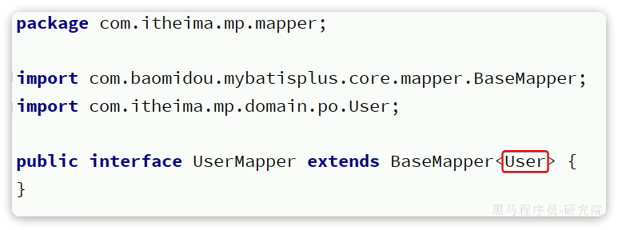

泛型中的 User 就是与数据库对应的 PO。

Mybatis Plus 就是根据 PO 实体的信息来推断出表的信息，从而生成 SQL 的。默认情况下：

- MybatisPlus 会把 PO 实体的类名驼峰转下划线作为表名
- MybatisPlus 会把 PO 实体的所有变量名驼峰转下划线作为表的字段名，并根据变量类型推断字段类型
- MybatisPlus 会把名为 id 的字段作为主键

但很多情况下，默认的实现与实际场景不符，因此 MybatisPlus 提供了一些注解便于我们声明表信息。

### 1.1.1 **@TableName**

说明：

- 描述：表名注解，标识实体类对应的表
- 使用位置：实体类

示例：

```Java
@TableName("user")
public class User {
    private Long id;
    private String name;
}
```

TableName 注解除了指定表名以外，还可以指定很多其它属性：

| **属性**         | **类型** | **必须指定** | **默认值** | **描述**                                                     |
| ---------------- | -------- | ------------ | ---------- | ------------------------------------------------------------ |
| value            | String   | 否           | ""         | 表名                                                         |
| schema           | String   | 否           | ""         | schema                                                       |
| keepGlobalPrefix | boolean  | 否           | false      | 是否保持使用全局的 tablePrefix 的值（当全局 tablePrefix 生效时） |
| resultMap        | String   | 否           | ""         | xml 中 resultMap 的 id（用于满足特定类型的实体类对象绑定）   |
| autoResultMap    | boolean  | 否           | false      | 是否自动构建 resultMap 并使用（如果设置 resultMap 则不会进行 resultMap 的自动构建与注入） |
| excludeProperty  | String[] | 否           | {}         | 需要排除的属性名 @since 3.3.1                                |

### 1.1.2 **@TableId**

说明：

- 描述：主键注解，标识实体类中的主键字段
- 使用位置：实体类的主键字段

示例：

```Java
@TableName("user")
public class User {
    @TableId
    private Long id;
    private String name;
}
```

`TableId`注解支持两个属性：

| **属性** | **类型** | **必须指定** | **默认值**  | **描述**     |
| :------- | :------- | :----------- | :---------- | :----------- |
| value    | String   | 否           | ""          | 表名         |
| type     | Enum     | 否           | IdType.NONE | 指定主键类型 |

`IdType`支持的类型有：

| **值**        | **描述**                                                     |
| :------------ | :----------------------------------------------------------- |
| AUTO          | 数据库 ID 自增                                               |
| NONE          | 无状态，该类型为未设置主键类型（注解里等于跟随全局，全局里约等于 INPUT） |
| INPUT         | insert 前自行 set 主键值                                     |
| ASSIGN_ID     | 分配 ID(主键类型为 Number(Long 和 Integer)或 String)(since 3.3.0),使用接口IdentifierGenerator的方法nextId(默认实现类为DefaultIdentifierGenerator雪花算法) |
| ASSIGN_UUID   | 分配 UUID,主键类型为 String(since 3.3.0),使用接口IdentifierGenerator的方法nextUUID(默认 default 方法) |
| ID_WORKER     | 分布式全局唯一 ID 长整型类型(please use ASSIGN_ID)           |
| UUID          | 32 位 UUID 字符串(please use ASSIGN_UUID)                    |
| ID_WORKER_STR | 分布式全局唯一 ID 字符串类型(please use ASSIGN_ID)           |

这里比较常见的有三种：

- `AUTO`：利用数据库的id自增长
- `INPUT`：手动生成id
- `ASSIGN_ID`：雪花算法生成`Long`类型的全局唯一id，这是默认的ID策略

### 1.1.3  **@TableField**

说明：

> 描述：普通字段注解

示例：

```Java
@TableName("user")
public class User {
    @TableId
    private Long id;
    private String name;
    private Integer age;
    @TableField("isMarried")
    private Boolean isMarried;
    @TableField("concat")
    private String concat;
}
```

一般情况下我们并不需要给字段添加 `@TableField` 注解，一些特殊情况除外：

- 成员变量名与数据库字段名不一致
- 成员变量是以 `isXXX` 命名，按照 `JavaBean` 的规范，`MybatisPlus` 识别字段时会把 `is` 去除，这就导致与数据库不符。
- 成员变量名与数据库一致，但是与数据库的关键字冲突。使用 `@TableField `注解给字段名添加````转义

支持的其它属性如下：

| **属性**         | **类型**   | **必填** | **默认值**            | **描述**                                                     |
| ---------------- | ---------- | -------- | --------------------- | ------------------------------------------------------------ |
| value            | String     | 否       | ""                    | 数据库字段名                                                 |
| exist            | boolean    | 否       | true                  | 是否为数据库表字段                                           |
| condition        | String     | 否       | ""                    | 字段 where 实体查询比较条件，有值设置则按设置的值为准，没有则为默认全局的 %s=#{%s}，[参考(opens new window)](https://github.com/baomidou/mybatis-plus/blob/3.0/mybatis-plus-annotation/src/main/java/com/baomidou/mybatisplus/annotation/SqlCondition.java) |
| update           | String     | 否       | ""                    | 字段 update set 部分注入，例如：当在version字段上注解update="%s+1" 表示更新时会 set version=version+1 （该属性优先级高于 el 属性） |
| insertStrategy   | Enum       | 否       | FieldStrategy.DEFAULT | 举例：NOT_NULL insert into table_a(<if test="columnProperty != null">column</if>) values (<if test="columnProperty != null">#{columnProperty}</if>) |
| updateStrategy   | Enum       | 否       | FieldStrategy.DEFAULT | 举例：IGNORED update table_a set column=#{columnProperty}    |
| whereStrategy    | Enum       | 否       | FieldStrategy.DEFAULT | 举例：NOT_EMPTY where <if test="columnProperty != null and columnProperty!=''">column=#{columnProperty}</if> |
| fill             | Enum       | 否       | FieldFill.DEFAULT     | 字段自动填充策略                                             |
| select           | boolean    | 否       | true                  | 是否进行 select 查询                                         |
| keepGlobalFormat | boolean    | 否       | false                 | 是否保持使用全局的 format 进行处理                           |
| jdbcType         | JdbcType   | 否       | JdbcType.UNDEFINED    | JDBC 类型 (该默认值不代表会按照该值生效)                     |
| typeHandler      | TypeHander | 否       |                       | 类型处理器 (该默认值不代表会按照该值生效)                    |
| numericScale     | String     | 否       | ""                    | 指定小数点后保留的位数                                       |

## 1.2 常见配置

大多数的配置都有默认值，因此我们都无需配置。但还有一些是没有默认值的，例如:

- 实体类的别名扫描包
- 全局 id 类型

```YAML
mybatis-plus:
  type-aliases-package: com.itheima.mp.domain.po
  global-config:
    db-config:
      id-type: auto # 全局id类型为自增长
```

需要注意的是，MyBatisPlus 也支持手写 SQL 的，而 mapper 文件的读取地址可以自己配置：

```YAML
mybatis-plus:
  mapper-locations: "classpath*:/mapper/**/*.xml" # Mapper.xml文件地址，当前这个是默认值。
```

可以看到默认值是 `classpath*:/mapper/**/*.xml `，也就是说我们只要把 mapper.xml 文件放置这个目录下就一定会被加载。

# 2. 核心功能

## **2.1 条件构造器**

除了新增以外，修改、删除、查询的 SQL 语句都需要指定 where 条件。因此 BaseMapper 中提供的相关方法除了以 `id` 作为`where `条件以外，还支持更加复杂的 `where` 条件。


参数中的 `Wrapper` 就是条件构造的抽象类，其下有很多默认实现，继承关系如图：

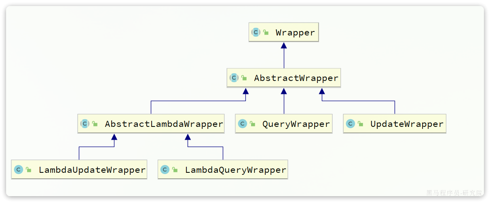

`Wrapper` 的子类 `AbstractWrapper` 提供了 where 中包含的所有条件构造方法：

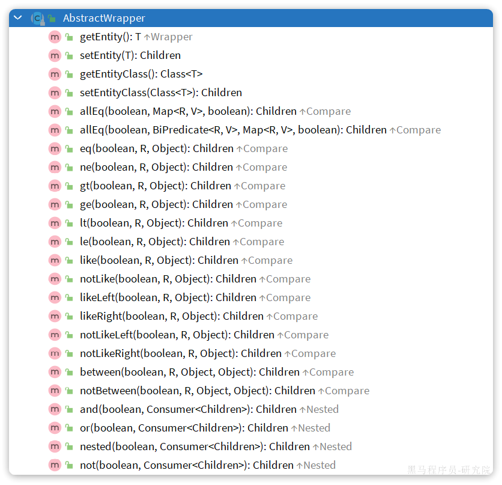

而 QueryWrapper 在 AbstractWrapper 的基础上拓展了一个select 方法，允许指定查询字段：


而 UpdateWrapper 在 AbstractWrapper 的基础上拓展了一个 set方法，允许指定 SQL 中的 SET 部分：

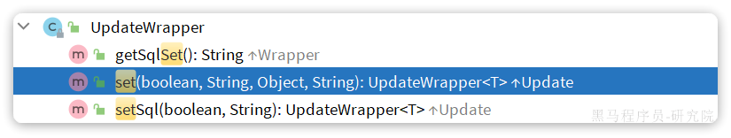

接下来，我们就来看看如何利用 `Wrapper` 实现复杂查询。

### **2.1.1 QueryWrapper**

无论是修改、删除、查询，都可以使用 QueryWrapper 来构建查询条件。接下来看一些例子： 

**查询**：查询出名字中带 `o` 的，存款大于等于 1000 元的人。代码如下：

```Java
@Test
void testQueryWrapper() {
    // 1.构建查询条件 where name like "%o%" AND balance >= 1000
    QueryWrapper<User> wrapper = new QueryWrapper<User>()
            .select("id", "username", "info", "balance")
            .like("username", "o")
            .ge("balance", 1000);
    // 2.查询数据
    List<User> users = userMapper.selectList(wrapper);
    users.forEach(System.out::println);
}
```

**更新**：更新用户名为jack的用户的余额为2000，代码如下：

```Java
@Test
void testUpdateByQueryWrapper() {
    // 1.构建查询条件 where name = "Jack"
    QueryWrapper<User> wrapper = new QueryWrapper<User>().eq("username", "Jack");
    // 2.更新数据，user中非null字段都会作为set语句
    User user = new User();
    user.setBalance(2000);
    userMapper.update(user, wrapper);
}
```

### **2.1.2 UpdateWrapper**

基于 BaseMapper 中的 update 方法更新时只能直接赋值，对于一些复杂的需求就难以实现。 例如：更新id为 `1,2,4` 的用户的余额，扣 200，对应的 SQL 应该是：

```Java
UPDATE user SET balance = balance - 200 WHERE id in (1, 2, 4)
```

SET 的赋值结果是基于字段现有值的，这个时候就要利用UpdateWrapper 中的 setSql 功能了：

```Java
@Test
void testUpdateWrapper() {
    List<Long> ids = List.of(1L, 2L, 4L);
    // 1.生成SQL
    UpdateWrapper<User> wrapper = new UpdateWrapper<User>()
            .setSql("balance = balance - 200") // SET balance = balance - 200
            .in("id", ids); // WHERE id in (1, 2, 4)
        // 2.更新，注意第一个参数可以给null，也就是不填更新字段和数据，
    // 而是基于UpdateWrapper中的setSQL来更新
    userMapper.update(null, wrapper);
}
```

### **2.1.3 LambdaQueryWrapper**

无论是 QueryWrapper 还是 UpdateWrapper 在构造条件的时候都需要写死字段名称，会出现字符串 `魔法值` 。这在编程规范中显然是不推荐的。 那怎么样才能不写字段名，又能知道字段名呢？

其中一种办法是基于变量的 `gettter` 方法结合反射技术。因此我们只要将条件对应的字段的 `getter` 方法传递给 MybatisPlus，它就能计算出对应的变量名了。而传递方法可以使用 JDK8 中的 `方法引用` 和 `Lambda` 表达式。 因此 MybatisPlus 又提供了一套基于 Lambda 的 Wrapper，包含两个：

- LambdaQueryWrapper
- LambdaUpdateWrapper

分别对应 QueryWrapper 和 UpdateWrapper

其使用方式如下：

```Java
@Test
void testLambdaQueryWrapper() {
    // 1.构建条件 WHERE username LIKE "%o%" AND balance >= 1000
    QueryWrapper<User> wrapper = new QueryWrapper<>();
    wrapper.lambda()
            .select(User::getId, User::getUsername, User::getInfo, User::getBalance)
            .like(User::getUsername, "o")
            .ge(User::getBalance, 1000);
    // 2.查询
    List<User> users = userMapper.selectList(wrapper);
    users.forEach(System.out::println);
}
```

## 2.2 自定义SQL

在演示 UpdateWrapper 的案例中，我们在代码中编写了更新的 SQL 语句：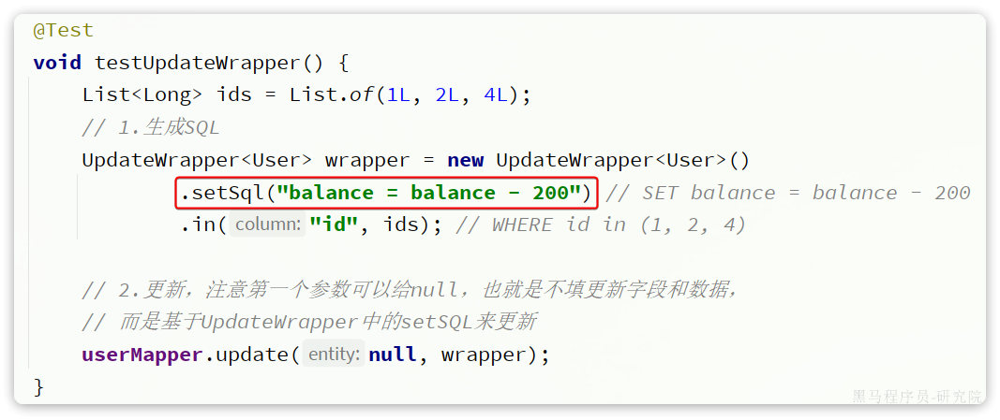

这种写法在某些企业也是不允许的，因为 SQL 语句最好都维护在持久层，而不是业务层。就当前案例来说，由于条件是 in 语句，只能将 SQL 写在 Mapper.xml 文件，利用 foreach 来生成动态 SQL 。 这实在是太麻烦了。假如查询条件更复杂，动态 SQL 的编写也会更加复杂。

所以，MybatisPlus 提供了自定义 SQL 功能，可以让我们利用Wrapper 生成查询条件，再结合 Mapper.xml 编写 SQL

### **2.2.1.基本用法**

以当前案例来说，我们可以这样写：

```Java
@Test
void testCustomWrapper() {
    // 1.准备自定义查询条件
    List<Long> ids = List.of(1L, 2L, 4L);
    QueryWrapper<User> wrapper = new QueryWrapper<User>().in("id", ids);

    // 2.调用mapper的自定义方法，直接传递Wrapper
    userMapper.deductBalanceByIds(200, wrapper);
}
```

然后在UserMapper中自定义SQL：

```Java
package com.itheima.mp.mapper;

import com.baomidou.mybatisplus.core.mapper.BaseMapper;
import com.itheima.mp.domain.po.User;
import org.apache.ibatis.annotations.Param;
import org.apache.ibatis.annotations.Update;

public interface UserMapper extends BaseMapper<User> {
    @Select("UPDATE user SET balance = balance - #{money} ${ew.customSqlSegment}")
    void deductBalanceByIds(@Param("money") int money, @Param("ew") QueryWrapper<User> wrapper);
}
```

这样就省去了编写复杂查询条件的烦恼了。

### **2.2.2 多表关联**

理论上来讲 MyBatisPlus 是不支持多表查询的，不过我们可以利用 Wrapper 中自定义条件结合自定义 SQL 来实现多表查询的效果。 例如，我们要查询出所有收货地址在北京的并且用户 id 在 1、2、4 之中的用户

要是自己基于 mybatis 实现 SQL，大概是这样的：

```XML
<select id="queryUserByIdAndAddr" resultType="com.itheima.mp.domain.po.User">
      SELECT *
      FROM user u
      INNER JOIN address a ON u.id = a.user_id
      WHERE u.id
      <foreach collection="ids" separator="," item="id" open="IN (" close=")">
          #{id}
      </foreach>
      AND a.city = #{city}
  </select>
```

可以看出其中最复杂的就是 WHERE 条件的编写，如果业务复杂一些，这里的 SQL 会更变态。

但是基于自定义 SQL 结合 Wrapper 的玩法，我们就可以利用Wrapper 来构建查询条件，然后手写 SELECT 及 FROM 部分，实现多表查询。

查询条件这样来构建：

```Java
@Test
void testCustomJoinWrapper() {
    // 1.准备自定义查询条件
    QueryWrapper<User> wrapper = new QueryWrapper<User>()
            .in("u.id", List.of(1L, 2L, 4L))
            .eq("a.city", "北京");

    // 2.调用mapper的自定义方法
    List<User> users = userMapper.queryUserByWrapper(wrapper);

    users.forEach(System.out::println);
}
```

然后在UserMapper中自定义方法：

```Java
@Select("SELECT u.* FROM user u INNER JOIN address a ON u.id = a.user_id ${ew.customSqlSegment}")
List<User> queryUserByWrapper(@Param("ew")QueryWrapper<User> wrapper);
```

当然，也可以在 `UserMapper.xml` 中写 SQL ：

```XML
<select id="queryUserByIdAndAddr" resultType="com.itheima.mp.domain.po.User">
    SELECT * FROM user u INNER JOIN address a ON u.id = a.user_id ${ew.customSqlSegment}
</select>
```

## **2.3 Service接口**

MybatisPlus 不仅提供了 BaseMapper，还提供了通用的 Service 接口及默认实现，封装了一些常用的 service 模板方法。 通用接口为 `IService`，默认实现为 `ServiceImpl`，其中封装的方法可以分为以下几类：

- `save`：新增
- `remove`：删除
- `update`：更新
- `get`：查询单个结果
- `list`：查询集合结果
- `count`：计数
- `page`：分页查询

### **2.3.1 **CRUD

我们先俩看下基本的 CRUD 接口。 **新增**：


- `save `是新增单个元素
- `saveBatch `是批量新增
- `saveOrUpdate` 是根据 id 判断，如果数据存在就更新，不存在则新增
- `saveOrUpdateBatch `是批量的新增或修改

**删除：**


- `removeById`：根据 id 删除
- `removeByIds`：根据 id 批量删除
- `removeByMap`：根据 Map 中的键值对为条件删除
- `remove(Wrapper<T>)`：根据 Wrapper 条件删除
- `~~removeBatchByIds~~`：暂不支持

**修改：**


- `updateById`：根据 id 修改
- `update(Wrapper<T>)`：根据 `UpdateWrapper` 修改，`Wrapper`中包含 `set` 和 `where` 部分
- `update(T，Wrapper<T>)`：按照 `T` 内的数据修改与 `Wrapper`匹配到的数据
- `updateBatchById`：根据 id 批量修改

**Get：**


- `getById`：根据 id 查询 1 条数据
- `getOne(Wrapper<T>)`：根据 `Wrapper `查询 1 条数据
- `getBaseMapper`：获取 `Service` 内的 `BaseMapper` 实现，某些时候需要直接调用 `Mapper` 内的自定义 `SQL` 时可以用这个方法获取到 `Mapper`

**List：**


- `listByIds`：根据 id 批量查询
- `list(Wrapper<T>)`：根据 Wrapper 条件查询多条数据
- `list()`：查询所有

**Count**：

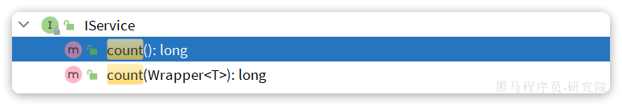

- `count()`：统计所有数量
- `count(Wrapper<T>)`：统计符合 `Wrapper` 条件的数据数量

**getBaseMapper**： 当我们在 service 中要调用 Mapper 中自定义 SQL 时，就必须获取 service 对应的 Mapper，就可以通过这个方法：

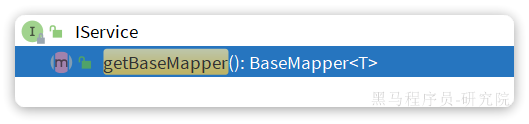

### **2.3.2.基本用法**

由于 `Service` 中经常需要定义与业务有关的自定义方法，因此我们不能直接使用 `IService` ，而是自定义 `Service` 接口，然后继承 `IService` 以拓展方法。同时，让自定义的 `Service实现类` 继承 `ServiceImpl` ，这样就不用自己实现 `IService` 中的接口了。

首先，定义 `IUserService`，继承 `IService` ：

```Java
package com.itheima.mp.service;

import com.baomidou.mybatisplus.extension.service.IService;
import com.itheima.mp.domain.po.User;

public interface IUserService extends IService<User> {
    // 拓展自定义方法
}
```

然后，编写 `UserServiceImpl` 类，继承 `ServiceImpl`，实现 `IUserService`：

```Java
package com.itheima.mp.service.impl;

import com.baomidou.mybatisplus.extension.service.impl.ServiceImpl;
import com.itheima.mp.domain.po.User;
import com.itheima.mp.domain.po.service.UserService;
import com.itheima.mp.mapper.UserMapper;
import org.springframework.stereotype.Service;

@Service
public class UserServiceImpl extends ServiceImpl<UserMapper, User>
                                                                                                        implements IUserService {
}
```

项目结构如下：


接下来，我们快速实现下面4个接口：

| **编号** | **接口**       | **请求方式** | **请求路径** | **请求参数** | **返回值** |
| :------- | :------------- | :----------- | :----------- | :----------- | :--------- |
| 1        | 新增用户       | POST         | /users       | 用户表单实体 | 无         |
| 2        | 删除用户       | DELETE       | /users/{id}  | 用户id       | 无         |
| 3        | 根据id查询用户 | GET          | /users/{id}  | 用户id       | 用户VO     |
| 4        | 根据id批量查询 | GET          | /users       | 用户id集合   | 用户VO集合 |

首先，我们在项目中引入几个依赖：

```XML
<!--swagger-->
<dependency>
    <groupId>com.github.xiaoymin</groupId>
    <artifactId>knife4j-openapi2-spring-boot-starter</artifactId>
    <version>4.1.0</version>
</dependency>
<!--web-->
<dependency>
    <groupId>org.springframework.boot</groupId>
    <artifactId>spring-boot-starter-web</artifactId>
</dependency>
```

然后需要配置 swagger 信息：

```YAML
knife4j:
  enable: true
  openapi:
    title: 用户管理接口文档
    description: "用户管理接口文档"
    email: zhanghuyi@itcast.cn
    concat: 虎哥
    url: https://www.itcast.cn
    version: v1.0.0
    group:
      default:
        group-name: default
        api-rule: package
        api-rule-resources:
          - com.itheima.mp.controller
```

然后，接口需要两个实体：

- UserFormDTO：代表新增时的用户表单
- UserVO：代表查询的返回结果

首先是 UserFormDTO：

```Java
package com.itheima.mp.domain.dto;

import com.baomidou.mybatisplus.annotation.TableField;
import com.baomidou.mybatisplus.extension.handlers.JacksonTypeHandler;
import io.swagger.annotations.ApiModel;
import io.swagger.annotations.ApiModelProperty;
import lombok.Data;

@Data
@ApiModel(description = "用户表单实体")
public class UserFormDTO {

    @ApiModelProperty("id")
    private Long id;

    @ApiModelProperty("用户名")
    private String username;

    @ApiModelProperty("密码")
    private String password;

    @ApiModelProperty("注册手机号")
    private String phone;

    @ApiModelProperty("详细信息，JSON风格")
    private String info;

    @ApiModelProperty("账户余额")
    private Integer balance;
}
```

然后是 UserVO：

```Java
package com.itheima.mp.domain.vo;

import io.swagger.annotations.ApiModel;
import io.swagger.annotations.ApiModelProperty;
import lombok.Data;

@Data
@ApiModel(description = "用户VO实体")
public class UserVO {
    
    @ApiModelProperty("用户id")
    private Long id;
    
    @ApiModelProperty("用户名")
    private String username;
    
    @ApiModelProperty("详细信息")
    private String info;

    @ApiModelProperty("使用状态（1正常 2冻结）")
    private Integer status;
    
    @ApiModelProperty("账户余额")
    private Integer balance;
}
```

最后，按照 Restful 风格编写 Controller 接口方法：

```Java
package com.itheima.mp.controller;

import cn.hutool.core.bean.BeanUtil;
import com.itheima.mp.domain.dto.UserFormDTO;
import com.itheima.mp.domain.po.User;
import com.itheima.mp.domain.vo.UserVO;
import com.itheima.mp.service.IUserService;
import io.swagger.annotations.Api;
import io.swagger.annotations.ApiOperation;
import lombok.RequiredArgsConstructor;
import org.springframework.web.bind.annotation.*;

import java.util.List;

@Api(tags = "用户管理接口")
@RequiredArgsConstructor
@RestController
@RequestMapping("users")
public class UserController {

    private final IUserService userService;

    @PostMapping
    @ApiOperation("新增用户")
    public void saveUser(@RequestBody UserFormDTO userFormDTO){
        // 1.转换DTO为PO
        User user = BeanUtil.copyProperties(userFormDTO, User.class);
        // 2.新增
        userService.save(user);
    }

    @DeleteMapping("/{id}")
    @ApiOperation("删除用户")
    public void removeUserById(@PathVariable("id") Long userId){
        userService.removeById(userId);
    }

    @GetMapping("/{id}")
    @ApiOperation("根据id查询用户")
    public UserVO queryUserById(@PathVariable("id") Long userId){
        // 1.查询用户
        User user = userService.getById(userId);
        // 2.处理vo
        return BeanUtil.copyProperties(user, UserVO.class);
    }

    @GetMapping
    @ApiOperation("根据id集合查询用户")
    public List<UserVO> queryUserByIds(@RequestParam("ids") List<Long> ids){
        // 1.查询用户
        List<User> users = userService.listByIds(ids);
        // 2.处理vo
        return BeanUtil.copyToList(users, UserVO.class);
    }
}
```

可以看到上述接口都直接在 controller 即可实现，无需编写任何 service 代码，非常方便。

不过，一些带有业务逻辑的接口则需要在 service 中自定义实现了。例如下面的需求：

- 根据 id 扣减用户余额

这看起来是个简单修改功能，只要修改用户余额即可。但这个业务包含一些业务逻辑处理：

- 判断用户状态是否正常
- 判断用户余额是否充足

这些业务逻辑都要在 service 层来做，另外更新余额需要自定义 SQL，要在 mapper 中来实现。因此，我们除了要编写 controller 以外，具体的业务还要在 service 和 mapper 中编写。

首先在 UserController 中定义一个方法：

```Java
@PutMapping("{id}/deduction/{money}")
@ApiOperation("扣减用户余额")
public void deductBalance(@PathVariable("id") Long id, @PathVariable("money")Integer money){
    userService.deductBalance(id, money);
}
```

然后是 UserService 接口：

```Java
package com.itheima.mp.service;

import com.baomidou.mybatisplus.extension.service.IService;
import com.itheima.mp.domain.po.User;

public interface IUserService extends IService<User> {
    void deductBalance(Long id, Integer money);
}
```

最后是 UserServiceImpl 实现类：

```Java
package com.itheima.mp.service.impl;

import com.baomidou.mybatisplus.extension.service.impl.ServiceImpl;
import com.itheima.mp.domain.po.User;
import com.itheima.mp.mapper.UserMapper;
import com.itheima.mp.service.IUserService;
import org.springframework.stereotype.Service;

@Service
public class UserServiceImpl extends ServiceImpl<UserMapper, User> implements IUserService {
    @Override
    public void deductBalance(Long id, Integer money) {
        // 1.查询用户
        User user = getById(id);
        // 2.判断用户状态
        if (user == null || user.getStatus() == 2) {
            throw new RuntimeException("用户状态异常");
        }
        // 3.判断用户余额
        if (user.getBalance() < money) {
            throw new RuntimeException("用户余额不足");
        }
        // 4.扣减余额
        baseMapper.deductMoneyById(id, money);
    }
}
```

最后是 mapper：

```Java
@Update("UPDATE user SET balance = balance - #{money} WHERE id = #{id}")
void deductMoneyById(@Param("id") Long id, @Param("money") Integer money);
```

### **2.3.3 Lambda**

IService 中还提供了 Lambda 功能来简化我们的复杂查询及更新功能。我们通过两个案例来学习一下。

案例一：实现一个根据复杂条件查询用户的接口，查询条件如下：

- name：用户名关键字，可以为空
- status：用户状态，可以为空
- minBalance：最小余额，可以为空
- maxBalance：最大余额，可以为空

可以理解成一个用户的后台管理界面，管理员可以自己选择条件来筛选用户，因此上述条件不一定存在，需要做判断。

我们首先需要定义一个查询条件实体，UserQuery 实体：

```Java
package com.itheima.mp.domain.query;

import io.swagger.annotations.ApiModel;
import io.swagger.annotations.ApiModelProperty;
import lombok.Data;

@Data
@ApiModel(description = "用户查询条件实体")
public class UserQuery {
    @ApiModelProperty("用户名关键字")
    private String name;
    @ApiModelProperty("用户状态：1-正常，2-冻结")
    private Integer status;
    @ApiModelProperty("余额最小值")
    private Integer minBalance;
    @ApiModelProperty("余额最大值")
    private Integer maxBalance;
}
```

接下来我们在 UserController 中定义一个 controller 方法：

```Java
@GetMapping("/list")
@ApiOperation("根据id集合查询用户")
public List<UserVO> queryUsers(UserQuery query){
    // 1.组织条件
    String username = query.getName();
    Integer status = query.getStatus();
    Integer minBalance = query.getMinBalance();
    Integer maxBalance = query.getMaxBalance();
    LambdaQueryWrapper<User> wrapper = new QueryWrapper<User>().lambda()
            .like(username != null, User::getUsername, username)
            .eq(status != null, User::getStatus, status)
            .ge(minBalance != null, User::getBalance, minBalance)
            .le(maxBalance != null, User::getBalance, maxBalance);
    // 2.查询用户
    List<User> users = userService.list(wrapper);
    // 3.处理vo
    return BeanUtil.copyToList(users, UserVO.class);
}
```

在组织查询条件的时候，我们加入了  `username != null`  这样的参数，意思就是当条件成立时才会添加这个查询条件，类似 Mybatis 的 mapper.xml 文件中的 `<if>` 标签。这样就实现了动态查询条件效果了。

不过，上述条件构建的代码太麻烦了。 因此 Service 中对  `LambdaQueryWrapper`  和  `LambdaUpdateWrapper`  的用法进一步做了简化。我们无需自己通过 `new` 的方式来创建  `Wrapper` ，而是直接调用 `lambdaQuery ` 和 `lambdaUpdate` 方法：

基于 Lambda 查询：

```Java
@GetMapping("/list")
@ApiOperation("根据id集合查询用户")
public List<UserVO> queryUsers(UserQuery query){
    // 1.组织条件
    String username = query.getName();
    Integer status = query.getStatus();
    Integer minBalance = query.getMinBalance();
    Integer maxBalance = query.getMaxBalance();
    // 2.查询用户
    List<User> users = userService.lambdaQuery()
            .like(username != null, User::getUsername, username)
            .eq(status != null, User::getStatus, status)
            .ge(minBalance != null, User::getBalance, minBalance)
            .le(maxBalance != null, User::getBalance, maxBalance)
            .list();
    // 3.处理vo
    return BeanUtil.copyToList(users, UserVO.class);
}
```

可以发现 lambdaQuery 方法中除了可以构建条件，还需要在链式编程的最后添加一个 `list()` ，这是在告诉 MP 我们的调用结果需要是一个 list 集合。这里不仅可以用 `list()` ，可选的方法有：

- `.one()`：最多1个结果
- `.list()`：返回集合结果
- `.count()`：返回计数结果

MybatisPlus 会根据链式编程的最后一个方法来判断最终的返回结果。

与 lambdaQuery 方法类似， IService 中的 lambdaUpdate 方法可以非常方便的实现复杂更新业务。

例如下面的需求：

> 需求：改造根据 id 修改用户余额的接口，要求如下
>
> - 如果扣减后余额为 0，则将用户 status 修改为冻结状态（2）

也就是说我们在扣减用户余额时，需要对用户剩余余额做出判断，如果发现剩余余额为 0，则应该将 status 修改为 2，这就是说 update 语句的 set 部分是动态的。

实现如下：

```Java
@Override
@Transactional
public void deductBalance(Long id, Integer money) {
    // 1.查询用户
    User user = getById(id);
    // 2.校验用户状态
    if (user == null || user.getStatus() == 2) {
        throw new RuntimeException("用户状态异常！");
    }
    // 3.校验余额是否充足
    if (user.getBalance() < money) {
        throw new RuntimeException("用户余额不足！");
    }
    // 4.扣减余额 update tb_user set balance = balance - ?
    int remainBalance = user.getBalance() - money;
    lambdaUpdate()
            .set(User::getBalance, remainBalance) // 更新余额
            .set(remainBalance == 0, User::getStatus, 2) // 动态判断，是否更新status
            .eq(User::getId, id)
            .eq(User::getBalance, user.getBalance()) // 乐观锁
            .update();
}
```

### **2.3.4 批量新增**

再试试 MybatisPlus 的批处理：

```Java
@Test
void testSaveBatch() {
    // 准备10万条数据
    List<User> list = new ArrayList<>(1000);
    long b = System.currentTimeMillis();
    for (int i = 1; i <= 100000; i++) {
        list.add(buildUser(i));
        // 每1000条批量插入一次
        if (i % 1000 == 0) {
            userService.saveBatch(list);
            list.clear();
        }
    }
    long e = System.currentTimeMillis();
    System.out.println("耗时：" + (e - b));
}
```

可以看到使用了批处理以后，比逐条新增效率提高了 10 倍左右，性能还是不错的。

不过，我们简单查看一下 `MybatisPlus` 源码：

```Java
@Transactional(rollbackFor = Exception.class)
@Override
public boolean saveBatch(Collection<T> entityList, int batchSize) {
    String sqlStatement = getSqlStatement(SqlMethod.INSERT_ONE);
    return executeBatch(entityList, batchSize, (sqlSession, entity) -> sqlSession.insert(sqlStatement, entity));
}
// ...SqlHelper
public static <E> boolean executeBatch(Class<?> entityClass, Log log, Collection<E> list, int batchSize, BiConsumer<SqlSession, E> consumer) {
    Assert.isFalse(batchSize < 1, "batchSize must not be less than one");
    return !CollectionUtils.isEmpty(list) && executeBatch(entityClass, log, sqlSession -> {
        int size = list.size();
        int idxLimit = Math.min(batchSize, size);
        int i = 1;
        for (E element : list) {
            consumer.accept(sqlSession, element);
            if (i == idxLimit) {
                sqlSession.flushStatements();
                idxLimit = Math.min(idxLimit + batchSize, size);
            }
            i++;
        }
    });
}
```

可以发现其实 `MybatisPlus` 的批处理是基于 `PrepareStatement` 的预编译模式，然后批量提交，最终在数据库执行时还是会有多条 insert 语句，逐条插入数据。

MySQL 的客户端连接参数中有这样的一个参数： `rewriteBatchedStatements` 。顾名思义，就是重写批处理的 `statement` 语句。

这个参数的默认值是 false，我们需要修改连接参数，将其配置为 true

修改项目中的 application.yml 文件，在 jdbc 的 url 后面添加参数`&rewriteBatchedStatements=true`:

```YAML
spring:
  datasource:
    url: jdbc:mysql://127.0.0.1:3306/mp?useUnicode=true&characterEncoding=UTF-8&autoReconnect=true&serverTimezone=Asia/Shanghai&rewriteBatchedStatements=true
    driver-class-name: com.mysql.cj.jdbc.Driver
    username: root
    password: MySQL123
```

# **3. 扩展功能**

## **3.1 代码生成**

在使用 MybatisPlus 以后，基础的 `Mapper`、`Service`、`PO` 代码相对固定，重复编写也比较麻烦。因此 MybatisPlus 官方提供了代码生成器根据数据库表结构生成 `PO`、`Mapper`、`Service` 等相关代码。只不过代码生成器同样要编码使用，也很麻烦。

这里推荐大家使用一款 `MybatisPlus` 的插件，它可以基于图形化界面完成 `MybatisPlus` 的代码生成，非常简单。

## **3.2 静态工具**

有的时候 Service 之间也会相互调用，为了避免出现循环依赖问题，MybatisPlus 提供一个静态工具类： `Db` ，其中的一些静态方法与 `IService` 中方法签名基本一致，也可以帮助我们实现 CRUD 功能：


示例：

```Java
@Test
void testDbGet() {
    User user = Db.getById(1L, User.class);
    System.out.println(user);
}

@Test
void testDbList() {
    // 利用Db实现复杂条件查询
    List<User> list = Db.lambdaQuery(User.class)
            .like(User::getUsername, "o")
            .ge(User::getBalance, 1000)
            .list();
    list.forEach(System.out::println);
}

@Test
void testDbUpdate() {
    Db.lambdaUpdate(User.class)
            .set(User::getBalance, 2000)
            .eq(User::getUsername, "Rose");
}
```

需求：改造根据 id 用户查询的接口，查询用户的同时返回用户收货地址列表

首先，我们要添加一个收货地址的 VO 对象：

```Java
package com.itheima.mp.domain.vo;

import io.swagger.annotations.ApiModel;
import io.swagger.annotations.ApiModelProperty;
import lombok.Data;

@Data
@ApiModel(description = "收货地址VO")
public class AddressVO{

    @ApiModelProperty("id")
    private Long id;

    @ApiModelProperty("用户ID")
    private Long userId;

    @ApiModelProperty("省")
    private String province;

    @ApiModelProperty("市")
    private String city;

    @ApiModelProperty("县/区")
    private String town;

    @ApiModelProperty("手机")
    private String mobile;

    @ApiModelProperty("详细地址")
    private String street;

    @ApiModelProperty("联系人")
    private String contact;

    @ApiModelProperty("是否是默认 1默认 0否")
    private Boolean isDefault;

    @ApiModelProperty("备注")
    private String notes;
}
```

然后，改造原来的 UserVO，添加一个地址属性：


接下来，修改 UserController 中根据 id 查询用户的业务接口：

```Java
@GetMapping("/{id}")
@ApiOperation("根据id查询用户")
public UserVO queryUserById(@PathVariable("id") Long userId){
    // 基于自定义service方法查询
    return userService.queryUserAndAddressById(userId);
}
```

由于查询业务复杂，所以要在 service 层来实现。首先在 IUserService 中定义方法：

```Java
package com.itheima.mp.service;

import com.baomidou.mybatisplus.extension.service.IService;
import com.itheima.mp.domain.po.User;
import com.itheima.mp.domain.vo.UserVO;

public interface IUserService extends IService<User> {
    void deduct(Long id, Integer money);

    UserVO queryUserAndAddressById(Long userId);
}
```

然后，在 UserServiceImpl 中实现该方法：

```Java
@Override
public UserVO queryUserAndAddressById(Long userId) {
    // 1.查询用户
    User user = getById(userId);
    if (user == null) {
        return null;
    }
    // 2.查询收货地址
    List<Address> addresses = Db.lambdaQuery(Address.class)
            .eq(Address::getUserId, userId)
            .list();
    // 3.处理vo
    UserVO userVO = BeanUtil.copyProperties(user, UserVO.class);
    userVO.setAddresses(BeanUtil.copyToList(addresses, AddressVO.class));
    return userVO;
}
```

在查询地址时，我们采用了 Db 的静态方法，因此避免了注入 AddressService，减少了循环依赖的风险。

## **3.3 逻辑删除**

对于一些比较重要的数据，我们往往会采用逻辑删除的方案，即：

- 在表中添加一个字段标记数据是否被删除
- 当删除数据时把标记置为 true
- 查询时过滤掉标记为 true 的数据

一旦采用了逻辑删除，所有的查询和删除逻辑都要跟着变化，非常麻烦。

为了解决这个问题，MybatisPlus 就添加了对逻辑删除的支持。

**注意**，只有 MybatisPlus 生成的 SQL 语句才支持自动的逻辑删除，自定义 SQL 需要自己手动处理逻辑删除。

例如，我们给 `address` 表添加一个逻辑删除字段：

```SQL
alter table address add deleted bit default b'0' null comment '逻辑删除';
```

然后给 `Address` 实体添加 `deleted` 字段：


接下来，我们要在 `application.yml` 中配置逻辑删除字段：

```YAML
mybatis-plus:
  global-config:
    db-config:
      logic-delete-field: deleted # 全局逻辑删除的实体字段名(since 3.3.0,配置后可以忽略不配置步骤2)
      logic-delete-value: 1 # 逻辑已删除值(默认为 1)
      logic-not-delete-value: 0 # 逻辑未删除值(默认为 0)
```

测试： 首先，我们执行一个删除操作：

```Java
@Test
void testDeleteByLogic() {
    // 删除方法与以前没有区别
    addressService.removeById(59L);
}
```

方法与普通删除一模一样，但是底层的SQL逻辑变了：


查询一下试试：

```Java
@Test
void testQuery() {
    List<Address> list = addressService.list();
    list.forEach(System.out::println);
}
```

会发现id为59的确实没有查询出来，而且SQL中也对逻辑删除字段做了判断：

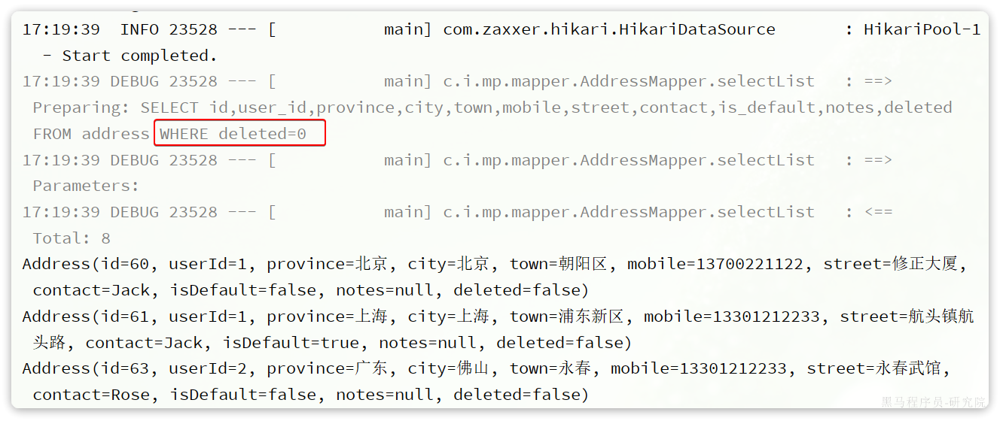

综上， 开启了逻辑删除功能以后，我们就可以像普通删除一样做 CRUD ，基本不用考虑代码逻辑问题。还是非常方便的。

**注意**： 逻辑删除本身也有自己的问题，比如：

- 会导致数据库表垃圾数据越来越多，从而影响查询效率
- SQL 中全都需要对逻辑删除字段做判断，影响查询效率

因此，我不太推荐采用逻辑删除功能，如果数据不能删除，可以采用把数据迁移到其它表的办法。

## **3.3 通用枚举**

User 类中有一个用户状态字段：


像这种字段我们一般会定义一个枚举，做业务判断的时候就可以直接基于枚举做比较。但是我们数据库采用的是 `int` 类型，对应的PO也是 `Integer` 。因此业务操作时必须手动把 `枚举` 与 `Integer` 转换，非常麻烦。

因此，MybatisPlus 提供了一个处理枚举的类型转换器，可以帮我们**把枚举类型与数据库类型自动转换**。

### **3.3.1 定义枚举**

我们定义一个用户状态的枚举：


代码如下：

```Java
package com.itheima.mp.enums;

import com.baomidou.mybatisplus.annotation.EnumValue;
import lombok.Getter;

@Getter
public enum UserStatus {
    NORMAL(1, "正常"),
    FREEZE(2, "冻结")
    ;
    private final int value;
    private final String desc;

    UserStatus(int value, String desc) {
        this.value = value;
        this.desc = desc;
    }
}
```

然后把 `User` 类中的 `status` 字段改为 `UserStatus`  类型：


要让 `MybatisPlus` 处理枚举与数据库类型自动转换，我们必须告诉 `MybatisPlus` ，枚举中的哪个字段的值作为数据库值。 `MybatisPlus` 提供了 `@EnumValue` 注解来标记枚举属性：


### **3.3.2 配置枚举处理器**

在 application.yaml 文件中添加配置：

```YAML
mybatis-plus:
  configuration:
    default-enum-type-handler: com.baomidou.mybatisplus.core.handlers.MybatisEnumTypeHandler
```

### **3.3.3 测试**

```Java
@Test
void testService() {
    List<User> list = userService.list();
    list.forEach(System.out::println);
}
```

最终，查询出的 `User` 类的 `status` 字段会是枚举类型：


同时，为了使页面查询结果也是枚举格式，我们需要修改 UserVO 中的 status 属性：


并且，在 UserStatus 枚举中通过 `@JsonValue` 注解标记 JSON 序列化时展示的字段：


最后，在页面查询，结果如下：

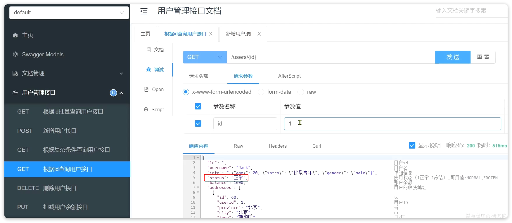

## **3.4 JSON类型处理器**

数据库的 user 表中有一个 `info` 字段，是 JSON 类型：


格式像这样：

```JSON
{"age": 20, "intro": "佛系青年", "gender": "male"}
```

而目前 `User` 实体类中却是 `String` 类型：


这样一来，我们要读取 info 中的属性时就非常不方便。如果要方便获取，info 的类型最好是一个 `Map` 或者实体类。

而一旦我们把 `info `改为 `对象` 类型，就需要在写入数据库时手动转为 `String` ，再读取数据库时，手动转换为 `对象` ，这会非常麻烦。

因此 MybatisPlus 提供了很多特殊类型字段的类型处理器，解决特殊字段类型与数据库类型转换的问题。例如处理 JSON 就可以使用 `JacksonTypeHandler` 处理器。

接下来，我们就来看看这个处理器该如何使用。

### **3.4.1 定义实体**

首先，我们定义一个单独实体类来与 info 字段的属性匹配：


代码如下：

```Java
package com.itheima.mp.domain.po;

import lombok.Data;

@Data
public class UserInfo {
    private Integer age;
    private String intro;
    private String gender;
}
```

### **3.4.2 使用类型处理器**

接下来，将 User 类的 info 字段修改为 UserInfo 类型，并声明类型处理器：

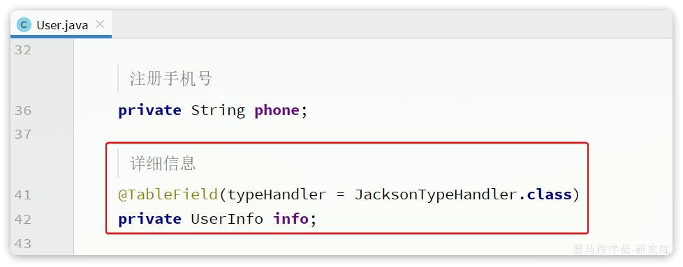

测试可以发现，所有数据都正确封装到 UserInfo 当中了：


同时，为了让页面返回的结果也以对象格式返回，我们要修改 UserVO 中的 info 字段：


此时，在页面查询结果如下：


# 4. 插件功能

MybatisPlus 提供了很多的插件功能，进一步拓展其功能。目前已有的插件有：

- `PaginationInnerInterceptor`：自动分页
- `TenantLineInnerInterceptor`：多租户
- `DynamicTableNameInnerInterceptor`：动态表名
- `OptimisticLockerInnerInterceptor`：乐观锁
- `IllegalSQLInnerInterceptor`：sql 性能规范
- `BlockAttackInnerInterceptor`：防止全表更新与删除

**注意：** 使用多个分页插件的时候需要注意插件定义顺序，建议使用顺序如下：

- 多租户，动态表名
- 分页，乐观锁
- sql 性能规范，防止全表更新与删除

这里我们以分页插件为里来学习插件的用法。

## **4.1 分页插件**

在未引入分页插件的情况下，`MybatisPlus` 是不支持分页功能的， `IService` 和 `BaseMapper` 中的分页方法都无法正常起效。 所以，我们必须配置分页插件。

### **4.1.1 配置分页插件**

在项目中新建一个配置类：


其代码如下：

```Java
package com.itheima.mp.config;

import com.baomidou.mybatisplus.annotation.DbType;
import com.baomidou.mybatisplus.extension.plugins.MybatisPlusInterceptor;
import com.baomidou.mybatisplus.extension.plugins.inner.PaginationInnerInterceptor;
import org.springframework.context.annotation.Bean;
import org.springframework.context.annotation.Configuration;

@Configuration
public class MybatisConfig {

    @Bean
    public MybatisPlusInterceptor mybatisPlusInterceptor() {
        // 初始化核心插件
        MybatisPlusInterceptor interceptor = new MybatisPlusInterceptor();
        // 添加分页插件
        interceptor.addInnerInterceptor(new PaginationInnerInterceptor(DbType.MYSQL));
        return interceptor;
    }
}
```

### **4.1.2 分页 API**

编写一个分页查询的测试：

```Java
@Test
void testPageQuery() {
    // 1.分页查询，new Page()的两个参数分别是：页码、每页大小
    Page<User> p = userService.page(new Page<>(2, 2));
    // 2.总条数
    System.out.println("total = " + p.getTotal());
    // 3.总页数
    System.out.println("pages = " + p.getPages());
    // 4.数据
    List<User> records = p.getRecords();
    records.forEach(System.out::println);
}
```

运行的SQL如下：


这里用到了分页参数，Page，即可以支持分页参数，也可以支持排序参数。常见的 API 如下：

```Java
int pageNo = 1, pageSize = 5;
// 分页参数
Page<User> page = Page.of(pageNo, pageSize);
// 排序参数, 通过OrderItem来指定
page.addOrder(new OrderItem("balance", false));

userService.page(page);
```

## **4.2 通用分页实体**

现在要实现一个用户分页查询的接口，接口规范如下：

| **参数** | **说明**                                                     |
| -------- | ------------------------------------------------------------ |
| 请求方式 | GET                                                          |
| 请求路径 | /users/page                                                  |
| 请求参数 | `{    "pageNo": 1,    "pageSize": 5,    "sortBy": "balance",    "isAsc": false,    "name": "o",    "status": 1 }` |
| 返回值   | ```{    "total": 100006,    "pages": 50003,    "list": [        {            "id": 1685100878975279298,            "username": "user_9****",            "info": {                "age": 24,                "intro": "英文老师",                "gender": "female"            },            "status": "正常",            "balance": 2000        }    ] }``` |
| 特殊说明 | 如果排序字段为空，默认按照更新时间排序排序字段不为空，则按照排序字段排序 |

这里需要定义 3 个实体：

- `UserQuery`：分页查询条件的实体，包含分页、排序参数、过滤条件
- `PageDTO`：分页结果实体，包含总条数、总页数、当前页数据
- `UserVO`：用户页面视图实体

### **4.2.1 实体**

由于 UserQuery 之前已经定义过了，并且其中已经包含了过滤条件，具体代码如下：

```Java
package com.itheima.mp.domain.query;

import io.swagger.annotations.ApiModel;
import io.swagger.annotations.ApiModelProperty;
import lombok.Data;

@Data
@ApiModel(description = "用户查询条件实体")
public class UserQuery {
    @ApiModelProperty("用户名关键字")
    private String name;
    @ApiModelProperty("用户状态：1-正常，2-冻结")
    private Integer status;
    @ApiModelProperty("余额最小值")
    private Integer minBalance;
    @ApiModelProperty("余额最大值")
    private Integer maxBalance;
}
```

其中缺少的仅仅是分页条件，而分页条件不仅仅用户分页查询需要，以后其它业务也都有分页查询的需求。因此建议将分页查询条件单独定义为一个 `PageQuery` 实体：


`PageQuery` 是前端提交的查询参数，一般包含四个属性：

- `pageNo`：页码
- `pageSize`：每页数据条数
- `sortBy`：排序字段
- `isAsc`：是否升序

```Java
@Data
@ApiModel(description = "分页查询实体")
public class PageQuery {
    @ApiModelProperty("页码")
    private Integer pageNo;
    @ApiModelProperty("页码")
    private Integer pageSize;
    @ApiModelProperty("排序字段")
    private String sortBy;
    @ApiModelProperty("是否升序")
    private Boolean isAsc;
}
```

然后，让我们的UserQuery继承这个实体：

```Java
package com.itheima.mp.domain.query;

import io.swagger.annotations.ApiModel;
import io.swagger.annotations.ApiModelProperty;
import lombok.Data;
import lombok.EqualsAndHashCode;

@EqualsAndHashCode(callSuper = true)
@Data
@ApiModel(description = "用户查询条件实体")
public class UserQuery extends PageQuery {
    @ApiModelProperty("用户名关键字")
    private String name;
    @ApiModelProperty("用户状态：1-正常，2-冻结")
    private Integer status;
    @ApiModelProperty("余额最小值")
    private Integer minBalance;
    @ApiModelProperty("余额最大值")
    private Integer maxBalance;
}
```

返回值的用户实体沿用之前定一个 `UserVO` 实体：

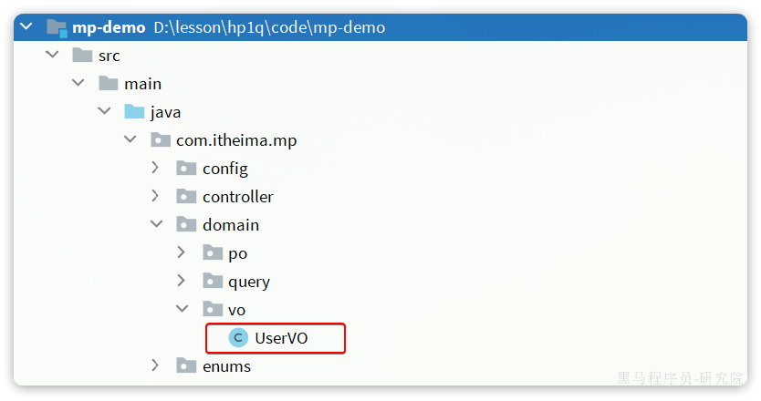

最后，则是分页实体 PageDTO :


代码如下：

```Java
package com.itheima.mp.domain.dto;

import io.swagger.annotations.ApiModel;
import io.swagger.annotations.ApiModelProperty;
import lombok.Data;

import java.util.List;

@Data
@ApiModel(description = "分页结果")
public class PageDTO<T> {
    @ApiModelProperty("总条数")
    private Long total;
    @ApiModelProperty("总页数")
    private Long pages;
    @ApiModelProperty("集合")
    private List<T> list;
}
```

### **4.2.2 开发接口**

我们在 `UserController` 中定义分页查询用户的接口：

```Java
package com.itheima.mp.controller;

import com.itheima.mp.domain.dto.PageDTO;
import com.itheima.mp.domain.query.PageQuery;
import com.itheima.mp.domain.vo.UserVO;
import com.itheima.mp.service.UserService;
import lombok.RequiredArgsConstructor;
import org.springframework.web.bind.annotation.GetMapping;
import org.springframework.web.bind.annotation.RequestMapping;
import org.springframework.web.bind.annotation.RestController;

@RestController
@RequestMapping("users")
@RequiredArgsConstructor
public class UserController {

    private final UserService userService;

    @GetMapping("/page")
    public PageDTO<UserVO> queryUsersPage(UserQuery query){
        return userService.queryUsersPage(query);
    }

    // 。。。 略
}
```

然后在 `IUserService` 中创建 `queryUsersPage` 方法：

```Java
PageDTO<UserVO> queryUsersPage(PageQuery query);
```

接下来，在 UserServiceImpl 中实现该方法：

```Java
@Override
public PageDTO<UserVO> queryUsersPage(PageQuery query) {
    // 1.构建条件
    // 1.1.分页条件
    Page<User> page = Page.of(query.getPageNo(), query.getPageSize());
    // 1.2.排序条件
    if (query.getSortBy() != null) {
        page.addOrder(new OrderItem(query.getSortBy(), query.getIsAsc()));
    }else{
        // 默认按照更新时间排序
        page.addOrder(new OrderItem("update_time", false));
    }
    // 2.查询
    page(page);
    // 3.数据非空校验
    List<User> records = page.getRecords();
    if (records == null || records.size() <= 0) {
        // 无数据，返回空结果
        return new PageDTO<>(page.getTotal(), page.getPages(), Collections.emptyList());
    }
    // 4.有数据，转换
    List<UserVO> list = BeanUtil.copyToList(records, UserVO.class);
    // 5.封装返回
    return new PageDTO<UserVO>(page.getTotal(), page.getPages(), list);
}
```

启动项目，在页面查看：


### **4.2.3 改造 PageQuery 实体**

在刚才的代码中，从 `PageQuery` 到 `MybatisPlus` 的 `Page` 之间转换的过程还是比较麻烦的。

我们完全可以在 `PageQuery` 这个实体中定义一个工具方法，简化开发。 像这样：

```Java
package com.itheima.mp.domain.query;

import com.baomidou.mybatisplus.core.metadata.OrderItem;
import com.baomidou.mybatisplus.extension.plugins.pagination.Page;
import lombok.Data;

@Data
public class PageQuery {
    private Integer pageNo;
    private Integer pageSize;
    private String sortBy;
    private Boolean isAsc;

    public <T>  Page<T> toMpPage(OrderItem ... orders){
        // 1.分页条件
        Page<T> p = Page.of(pageNo, pageSize);
        // 2.排序条件
        // 2.1.先看前端有没有传排序字段
        if (sortBy != null) {
            p.addOrder(new OrderItem(sortBy, isAsc));
            return p;
        }
        // 2.2.再看有没有手动指定排序字段
        if(orders != null){
            p.addOrder(orders);
        }
        return p;
    }

    public <T> Page<T> toMpPage(String defaultSortBy, boolean isAsc){
        return this.toMpPage(new OrderItem(defaultSortBy, isAsc));
    }

    public <T> Page<T> toMpPageDefaultSortByCreateTimeDesc() {
        return toMpPage("create_time", false);
    }

    public <T> Page<T> toMpPageDefaultSortByUpdateTimeDesc() {
        return toMpPage("update_time", false);
    }
}
```

这样我们在开发也时就可以省去对从 `PageQuery` 到 `Page` 的的转换：

```Java
// 1.构建条件
Page<User> page = query.toMpPageDefaultSortByCreateTimeDesc();
```

### **4.2.4 改造 PageDTO 实体**

在查询出分页结果后，数据的非空校验，数据的 vo 转换都是模板代码，编写起来很麻烦。

我们完全可以将其封装到 PageDTO 的工具方法中，简化整个过程：

```Java
package com.itheima.mp.domain.dto;

import cn.hutool.core.bean.BeanUtil;
import com.baomidou.mybatisplus.extension.plugins.pagination.Page;
import lombok.AllArgsConstructor;
import lombok.Data;
import lombok.NoArgsConstructor;

import java.util.Collections;
import java.util.List;
import java.util.function.Function;
import java.util.stream.Collectors;

@Data
@NoArgsConstructor
@AllArgsConstructor
public class PageDTO<V> {
    private Long total;
    private Long pages;
    private List<V> list;

    /**
     * 返回空分页结果
     * @param p MybatisPlus的分页结果
     * @param <V> 目标VO类型
     * @param <P> 原始PO类型
     * @return VO的分页对象
     */
    public static <V, P> PageDTO<V> empty(Page<P> p){
        return new PageDTO<>(p.getTotal(), p.getPages(), Collections.emptyList());
    }

    /**
     * 将MybatisPlus分页结果转为 VO分页结果
     * @param p MybatisPlus的分页结果
     * @param voClass 目标VO类型的字节码
     * @param <V> 目标VO类型
     * @param <P> 原始PO类型
     * @return VO的分页对象
     */
    public static <V, P> PageDTO<V> of(Page<P> p, Class<V> voClass) {
        // 1.非空校验
        List<P> records = p.getRecords();
        if (records == null || records.size() <= 0) {
            // 无数据，返回空结果
            return empty(p);
        }
        // 2.数据转换
        List<V> vos = BeanUtil.copyToList(records, voClass);
        // 3.封装返回
        return new PageDTO<>(p.getTotal(), p.getPages(), vos);
    }

    /**
     * 将MybatisPlus分页结果转为 VO分页结果，允许用户自定义PO到VO的转换方式
     * @param p MybatisPlus的分页结果
     * @param convertor PO到VO的转换函数
     * @param <V> 目标VO类型
     * @param <P> 原始PO类型
     * @return VO的分页对象
     */
    public static <V, P> PageDTO<V> of(Page<P> p, Function<P, V> convertor) {
        // 1.非空校验
        List<P> records = p.getRecords();
        if (records == null || records.size() <= 0) {
            // 无数据，返回空结果
            return empty(p);
        }
        // 2.数据转换
        List<V> vos = records.stream().map(convertor).collect(Collectors.toList());
        // 3.封装返回
        return new PageDTO<>(p.getTotal(), p.getPages(), vos);
    }
}
```

最终，业务层的代码可以简化为：

```Java
@Override
public PageDTO<UserVO> queryUserByPage(PageQuery query) {
    // 1.构建条件
    Page<User> page = query.toMpPageDefaultSortByCreateTimeDesc();
    // 2.查询
    page(page);
    // 3.封装返回
    return PageDTO.of(page, UserVO.class);
}
```

如果是希望自定义 PO 到 VO 的转换过程，可以这样做：

```Java
@Override
public PageDTO<UserVO> queryUserByPage(PageQuery query) {
    // 1.构建条件
    Page<User> page = query.toMpPageDefaultSortByCreateTimeDesc();
    // 2.查询
    page(page);
    // 3.封装返回
    return PageDTO.of(page, user -> {
        // 拷贝属性到VO
        UserVO vo = BeanUtil.copyProperties(user, UserVO.class);
        // 用户名脱敏
        String username = vo.getUsername();
        vo.setUsername(username.substring(0, username.length() - 2) + "**");
        return vo;
    });
}
```

最终查询的结果如下：


